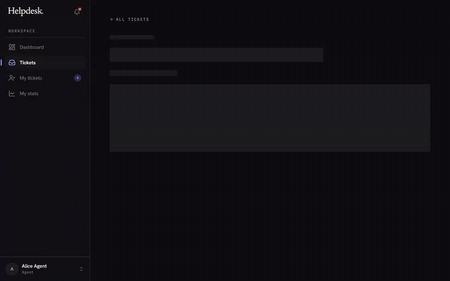
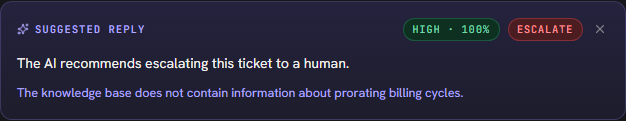

# Helpdesk

> **AI-powered ticket management.** Support emails arrive, get auto-classified and triaged, and the obvious questions resolve themselves. Agents handle what needs a human — with an AI that drafts and polishes replies, but never sends them for you.

**Live demo:** [helpdesk.tjemsland.dev](https://helpdesk.tjemsland.dev) — agent credentials available on request

Built with React 19, Bun, TypeScript, Prisma, Better Auth, and Google Gemini.

<p align="center">
  
  <br>
  <em>Write a rough draft, let the AI polish it for tone and structure, then nudge it with a one-line note — the agent always owns the send.</em>
</p>

---

## A guided tour

A support tool for a small team. Customers email in, agents work a queue, and AI does the boring parts in between. Two roles: **agents** work tickets; **admins** additionally manage the roster and the rules everything runs on.

### The queue arrives already triaged


Within seconds of Resend delivering an email, Gemini reads it, assigns a **category** and **priority**, and checks the knowledge base. By the time an agent logs in, every row has a category, a priority, and an SLA badge. The filters along the top — status, category, priority, and a *Breached only* toggle — cut the queue to the slice you care about, and search matches sender, email, or subject.

<p align="center"></p>

### A ticket the AI handled end to end


When the knowledge base clearly covers a question — *"what's your refund policy?"* — the AI drafts a grounded reply, sends it, and marks the ticket **resolved** with itself as assignee. Open it and the whole story is there: the customer's question, the AI's auto-reply, an **AUTO-CLASSIFIED BY AI** / **HANDLED BY AUTOMATION** marker, and an activity feed that records *AI auto-resolved the ticket*. No agent was paged.

### Working a ticket, with the AI alongside

When a ticket needs a human, the composer has two AI moves — and the agent owns the send either way.

**Suggest reply** drafts a grounded answer from the knowledge base, with a confidence score:

<p align="center"></p>

If the KB doesn't cover the question, the AI says so and recommends escalating rather than guessing:

<p align="center"></p>

**Polish with AI** takes the agent's own rough draft and rewrites it for tone and structure — substance untouched — then accepts a refinement note for a second pass (the GIF up top). And **internal notes** sit on a separate, amber-tinted tab, visible to other agents but never the customer:

<p align="center"></p>

### A knowledge base that grows itself

The AI grounds every answer in a structured, admin-curated knowledge base — not a wiki the AI can edit. New articles come from real resolutions: on a resolved ticket an agent clicks **Suggest for KB**, and the AI drafts an article from the thread as a *pending suggestion*. A daily job does the same automatically, clustering recurring resolved tickets.


Nothing publishes on its own — **admin approval is the security boundary** (ticket text is attacker-controllable). Admins review the queue and approve or reject:

<table>
<tr>
<td width="50%"></td>
<td width="50%"></td>
</tr>
<tr>
<td align="center"><em>The agent's suggestion lands in the review queue…</em></td>
<td align="center"><em>…an admin edits it and publishes — now the AI can ground on it.</em></td>
</tr>
</table>

### Your own work

<table>
<tr>
<td width="50%"></td>
<td width="50%"></td>
</tr>
</table>

Each agent gets a personal queue split into what they're **working on** and what's **closed**, plus a stats page: open tickets, resolved over 30 days and lifetime, average resolution and first-reply times, reply counts. Throughput credits whoever's currently assigned; reply counts follow authorship and survive reassignment.

---

## Administration

Admins get everything agents have, plus a workspace-wide view and the controls that shape how the queue behaves.

### The team dashboard


Open / triaging / breached / unassigned counts up top, an AI-activity card (auto-classified, replies sent, escalated), a live recent-activity feed, tickets by category, the highest-priority tickets needing attention, and SLA-compliance gauges for first response and resolution.

### Managing the roster


Each row shows a teammate's role, status (`active` / `invited` / `inactive`), open assignments, tickets resolved, average resolution time, and last-active. Nobody is ever handed a password — inviting a teammate (as agent **or** admin) creates them `invited` with no credential and emails a single-use link; they set their own password on first visit, which flips them to `active`.

<table>
<tr>
<td width="50%"></td>
<td width="50%"></td>
</tr>
<tr>
<td align="center"><em>Invite an agent or admin…</em></td>
<td align="center"><em>…they set their own password from the emailed link.</em></td>
</tr>
</table>

Guardrails keep the workspace from locking itself out: you can't deactivate or remove yourself or the last admin, deactivating someone ends their live sessions on the spot, and removing them voids any pending invite.

### The rules every ticket follows

The lifecycle and the SLA windows aren't hard-coded — admins own both on the **Workflow** screen. Lifecycle rules cover auto-assignment, AI auto-resolve and its confidence threshold, resolve gates, the auto-close quiet period, and reopen-on-reply. SLA targets set first-response and resolution windows per priority, each with its own at-risk threshold:

<table>
<tr>
<td width="50%"></td>
<td width="50%"></td>
</tr>
</table>

### Reading the room

The **Activity** page is the global audit log, and it opens with a **Watchlist** — operational-health signals read straight from the audit stream over the last 7 days:

<p align="center"></p>

AI escalation rate, AI hard failures (API/parse faults, separated from content gaps), reassignment churn, resolutions that didn't stick (reopened < 24h), and priority re-triage. Each pairs a number with a threshold state, a week-over-week delta coloured by *direction of harm*, and a one-line read of the likely cause. Rows are severity-sorted, and clicking one filters the log below.


### How customers experience it

Customers never log in. They email an address and continue the conversation by replying. They don't see categories, priorities, or SLAs — just normal email replies, some of which happen to be drafted by an AI grounded in the team's own knowledge base. A reply on a resolved ticket auto-reopens it (and unassigns the AI so a human picks it up); a reply on a closed ticket starts a fresh one.

---

## How it works

### Tech stack

| Layer | Choice |
| --- | --- |
| Runtime | [Bun](https://bun.sh) (server + tooling) |
| Frontend | React 19, Vite, TypeScript, Tailwind CSS v4, [shadcn/ui](https://ui.shadcn.com), TanStack Query, React Router |
| Backend | Express 5, TypeScript |
| Auth | [Better Auth](https://www.better-auth.com) — DB-backed sessions |
| Database | PostgreSQL via [Prisma](https://www.prisma.io) 7 |
| AI | Google Gemini (`gemini-2.5-flash-lite`) via the [Vercel AI SDK](https://sdk.vercel.ai) |
| Email | [Resend](https://resend.com) — outbound + inbound webhook |
| Jobs | [pg-boss](https://github.com/timgit/pg-boss) — Postgres-backed queue |
| Errors | [Sentry](https://sentry.io) — client + server |
| Testing | [Vitest](https://vitest.dev) (component + integration) + [Playwright](https://playwright.dev) (E2E) |
| Deploy | [Railway](https://railway.com) + multi-stage Docker |
| CI | GitHub Actions — lint, typecheck, audit, tests, Docker build |

### The shape of the system

```
                     ┌────────────────────────────────────────┐
  customer email ───►│  Resend  ───webhook───►  /api/inbound  │
                     └────────────────────────────────────────┘
                                                      │
                              ┌───────────────────────┼───────────────────────┐
                              │                       │                       │
                              ▼                       ▼                       ▼
                       classify (AI)           auto-resolve (AI)        agent queue
                       category + priority     when KB matches          status: open
                              │                       │                       │
                              └───────────────────────┴──────► audit log + SLA timers
```

Three workspaces share one source of truth for types:

```
helpdesk/
├── core/     @helpdesk/core    — Zod schemas + TS enums (Role, TicketStatus, …)
├── server/   @helpdesk/server  — Express + AI workers + queue consumers
└── client/   @helpdesk/client  — React SPA, served by Express in production
```

Every server input and every client form validates against the **same** Zod schema in `core/src/schemas.ts`. The `Role`, `TicketStatus`, `TicketCategory`, `TicketPriority`, and `SenderType` enums also live there — neither side accepts raw strings anywhere.

### Design decisions worth calling out

**Ticket lifecycle as an explicit state machine.** Statuses are `new → processing → open → resolved → closed`, with disallowed transitions rejected at the route layer (you can't jump `open → closed`; resolved tickets auto-close after a configurable quiet period — default 7 days — via a cron worker; admins can force-close or reopen anything). The agent UI collapses `new` and `processing` into a single read-only "Triaging" pill while the AI is still working, so agents can't reassign a half-classified ticket.

**Postgres as the queue, not Redis.** [`pg-boss`](https://github.com/timgit/pg-boss) runs the classification, auto-resolve, email-send, SLA-breach, auto-close, and KB gap-analysis jobs as durable queues in the same database that holds the application data. One fewer service to run, and "did this job complete?" is a SQL query against the queue table. Tradeoff: lower raw throughput than dedicated brokers — fine for a support tool.

**AI behind a provider-agnostic interface.** All AI calls go through the [Vercel AI SDK](https://sdk.vercel.ai)'s `generateText` / structured-output helpers. The bound provider is Google Gemini via `@ai-sdk/google`, but swapping to Claude or OpenAI is a one-line import change. Structured outputs (categorization, suggested-reply confidence, KB drafts) are declared with Zod and validated automatically.

**AI polishes; it never drafts blindly — and never publishes on its own.** "Polish with AI" rewrites the agent's draft for tone and clarity; it can't invent content. "Suggest reply" drafts from the knowledge base, but an agent reviews and sends it. KB articles are only ever created through admin approval. Auto-resolve is the single path where AI sends without a human, and it's gated on a strict KB match — if Gemini isn't confident, the ticket goes to the human queue. Because ticket text is attacker-controllable, every drafting prompt fences it in delimiters and escapes the delimiter characters so it can't break out.

**Idempotent inbound webhook.** Resend's `email-received` webhook is at-least-once. Each Ticket and Reply has a unique `resendEmailId`; the handler dedupes on that key so a redelivered webhook can't create duplicates. The webhook signature is verified before any payload is parsed.

**Better Auth with DB sessions, not JWTs.** Logout is a real revocation. Password changes invalidate sessions across devices, and a deactivated account is booted from its live sessions on the spot (a custom login gate also blocks anyone whose status isn't `active`). The `role` field is a Better Auth `additionalField` with `input: false`, so the signup/update endpoints can never touch it — role changes flow only through dedicated admin routes.

**Polymorphic attachments enforced at the DB level.** A single `Attachment` row belongs to either a `Reply` or a `Ticket`, never both — a raw `CHECK (replyId IS NULL) <> (ticketId IS NULL)` constraint in the migration makes invalid combinations fail at insert time, not just in the app layer.

**Audit log as a first-class table.** Every status change, assignee change, reply, AI escalation, and auto-action emits an `AuditEvent`. The ticket activity feed and the Activity-page Watchlist both read straight from it — no separate logging system, and it's queryable with SQL when something looks off in production.

**Testing Trophy, not pyramid.** Component tests in jsdom cover UI logic, integration tests hit a real Postgres via supertest, and Playwright E2E only covers full-journey flows that you can't fake. The database is never mocked in server tests, because the migrations + schema are exactly what's being verified.

### Repository layout

Per-workspace conventions, key files, and gotchas live in [CLAUDE.md](CLAUDE.md) at the repo root and inside `client/` and `server/`. A few orientation pointers:

- [core/src/schemas.ts](core/src/schemas.ts) — shared Zod schemas (server + client)
- [server/src/app.ts](server/src/app.ts) — Express app, importable by tests (no `app.listen`)
- [server/src/lib/auth.ts](server/src/lib/auth.ts) — Better Auth config
- [server/prisma/schema.prisma](server/prisma/schema.prisma) — full data model (incl. `KbArticle` / `KbSuggestion`)
- [server/src/lib/kb-corpus.ts](server/src/lib/kb-corpus.ts) — the KB retrieval seam the AI grounds on
- [client/src/App.tsx](client/src/App.tsx) — route tree + `ProtectedLayout` / `AdminLayout`
- [tools/readme-shots/](tools/readme-shots/) — the Playwright harness that produces every screenshot above

---

## Known limitations

This is a portfolio-stage project. It works end-to-end but is intentionally scoped for one team running one product.

- **Single tenant.** No notion of multiple organizations or workspaces.
- **No customer portal.** Customers interact via email only — no login, no "view your ticket status" page.
- **No 2FA or SSO.** Email + password only. Sessions live in the database with a configurable expiry.
- **Flat admin model.** Any admin can invite more admins and promote agents, with no second approval — deliberate so the workspace is easy to bootstrap, but it's setup-grade access control, not per-permission RBAC. Removal *is* guarded so you can't lock everyone out.
- **AI is best-effort.** Gemini's classification and auto-resolve are probabilistic. Misclassifications happen; agents can always override, and auto-resolve only fires on a confident KB match.
- **Knowledge base is curated, not crawled.** Articles are written/approved by admins (often from AI-suggested drafts); there's no automatic ingestion of external docs, and retrieval is category-filtered rather than vector search — `getRelevantArticles()` is the single seam a future pgvector upgrade would replace.
- **No real-time updates.** The UI refetches on focus and after mutations; it doesn't push via WebSocket.
- **English only.** Gemini replies in the customer's language, but UI strings are English.
- **No business-hours awareness in SLAs.** Timers run on wall-clock time — a weekend ticket counts against the same deadline as a Monday one.
- **Activity health-signal thresholds are hard-coded** named constants in `server/src/lib/health-signals.ts` (research-grounded defaults), not yet admin-configurable.
- **Email reply parsing is heuristic.** [`email-reply-parser`](https://github.com/crisp-oss/email-reply-parser) handles most clients, but exotic quoting can leak signatures into the visible body.
- **No full-text search across replies.** Tickets are searchable by name / email / subject; reply bodies aren't indexed.

If you spot something here that's blocking a real use case, open an issue.

---

## License

No license file is in the repo yet — defaults to "all rights reserved" until one is added. If you want to fork or learn from this code, [open an issue](https://github.com/DennisKodehode/helpdesk/issues) and we can sort out a permissive license (MIT or Apache 2.0).
