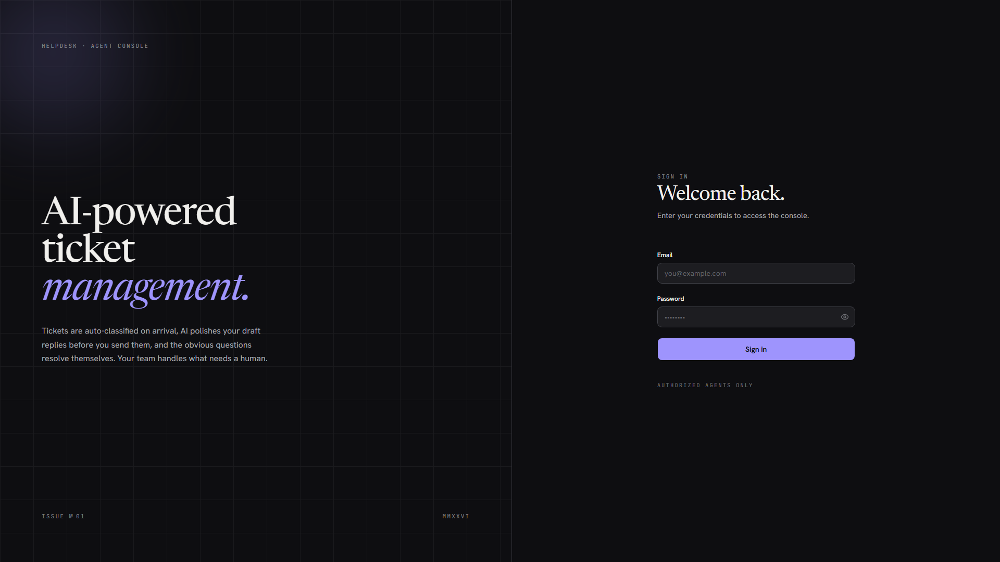
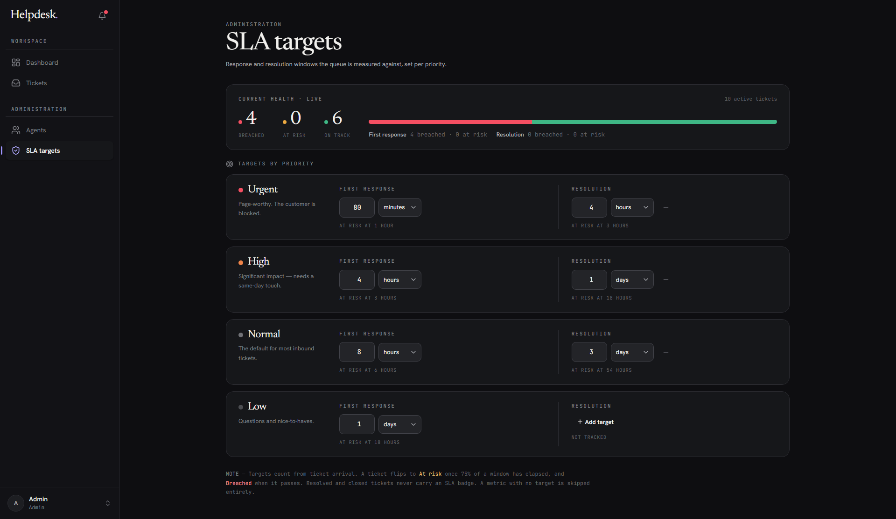

# Helpdesk

> **AI-powered ticket management.** Tickets are auto-classified on arrival, AI polishes draft replies before you send them, and the obvious questions resolve themselves. Your team handles what needs a human.

**Live demo:** [helpdesk.tjemsland.dev](https://helpdesk.tjemsland.dev) — agent credentials available on request

Built with React 19, Bun, TypeScript, Prisma, Better Auth, and Google Gemini.



---

## What it does

A support tool for a small team. Customers email in, agents reply, and AI does the boring parts in between. There are two roles: **agents** work the queue, and **admins** additionally manage the roster and the rules everything runs on. Here's what each scenario looks like in practice.

### A ticket the AI can answer

A customer emails: *"Why was I charged twice for the React course last week?"*

Within seconds of Resend delivering the email, Gemini reads it, classifies it as `billing` / `normal`, and checks the knowledge base. There's an article about duplicate charges from webhook retries — high-confidence match. The AI drafts a reply quoting the policy, sends it via Resend, and marks the ticket `resolved` with itself as the assignee. The customer gets an answer in under a minute. No agent is paged.


By the time an agent logs in, the queue is already triaged. Every row has a category, a priority, and an SLA badge. Filters along the top — status, category, priority, and a *Breached only* toggle — cut the queue down to the slice you care about, and the search box matches sender, email, or subject.


Open one the AI handled and the whole story is there: the customer's question, the AI's auto-reply grounded in the knowledge base, the `RESOLVED` status, and an **AUTO-CLASSIFIED BY AI** / **HANDLED BY AUTOMATION** marker. The activity feed on the right records every step, including *AI auto-resolved the ticket*.

### A ticket that needs a human

A different customer emails: *"URGENT: payment failed and my account is locked. I can't sign in at all."*

Gemini classifies it correctly — `billing` / `urgent` — but the knowledge base has nothing about account lockouts. Instead of guessing, the AI stays out of it. The ticket lands in the human queue as `open`, with the urgent first-response SLA timer running.


Each agent has their own queue split into what they're **working on** and what's already **closed**. Opening a ticket shows the full conversation, the AI's classification, and the SLA timer counting down. The agent can write a reply and **Polish with AI** — tone and grammar get a quick pass, substance untouched — or click **Suggest reply** to have the AI draft a grounded answer from the knowledge base for them to review and edit. Either way the agent owns the send. Resend delivers the email, the first-response timer stops, and the audit log records who replied and when.

### When customers come back

If the customer replies later, the inbound webhook matches the reply to the existing ticket (same sender, same subject thread). A resolved ticket auto-reopens and gets unassigned from the AI, so the next available human picks it up. A reply on a *closed* ticket spawns a fresh one. No duplicate tickets, no orphaned threads.

### Tracking your own work


Every agent gets a personal dashboard: open tickets on their plate, tickets resolved over the last 30 days and lifetime, average resolution time, average first-reply time, and reply counts. Throughput and resolution time credit whoever's currently assigned; reply counts follow authorship and survive reassignment.

### How customers experience it

Customers never log in. They email an address and continue the conversation by replying. They don't see categories, priorities, or SLAs — just normal email replies, some of which happen to be drafted by an AI grounded in the team's own knowledge base.

---

## Administration

Admins get everything agents have, plus a workspace-wide view and the controls that shape how the queue behaves.

### The team dashboard


The admin dashboard aggregates the whole workspace: open / triaging / breached / unassigned counts up top, an AI-activity card (auto-classified, replies sent, escalated), a live recent-activity feed, tickets broken down by category, the highest-priority tickets needing attention, and SLA-compliance gauges for first response and resolution. It's the morning glance that tells you where the team stands.

### Managing agents


The roster is the admin's control panel for people. Each row shows the teammate's role, status (`active` / `invited` / `inactive`), open assignments, tickets resolved, average resolution time, and when they were last active. From here an admin can **invite** a teammate, **change their role** (promote an agent to admin, or demote back), **deactivate / reactivate** them, and **remove** them from the team. The AI user appears here too — marked as automation and excluded from the human seat count.

Guardrails keep the workspace from locking itself out: you can't deactivate or remove yourself or *any* admin, you can't demote yourself, and the last remaining admin can't be demoted. Deactivating someone immediately ends their live sessions; removing them also voids any pending invite.

Nobody is ever handed a password. Inviting a teammate — as agent **or** admin — creates them in an `invited` state with no credential and emails a single-use link; they set their own password on first visit, which flips them to `active`.


### Setting SLA targets



SLAs aren't hard-coded — admins set first-response and resolution windows per priority (urgent → low), each with its own at-risk threshold. A live health bar at the top shows how the current queue is tracking against those targets in real time. Tickets flip to **At risk** once 75% of a window has elapsed and **Breached** when it passes; resolved and closed tickets stop carrying a badge. A metric with no target set is simply skipped.

---

## How it works

### Tech stack

| Layer | Choice |
| --- | --- |
| Runtime | [Bun](https://bun.sh) (server + tooling) |
| Frontend | React 19, Vite, TypeScript, Tailwind CSS v4, [shadcn/ui](https://ui.shadcn.com), TanStack Query, React Router |
| Backend | Express 5, TypeScript |
| Auth | [Better Auth](https://www.better-auth.com) — DB-backed sessions |
| Database | PostgreSQL via [Prisma](https://www.prisma.io) 7 |
| AI | Google Gemini (`gemini-2.5-flash-lite`) via the [Vercel AI SDK](https://sdk.vercel.ai) |
| Email | [Resend](https://resend.com) — outbound + inbound webhook |
| Jobs | [pg-boss](https://github.com/timgit/pg-boss) — Postgres-backed queue |
| Errors | [Sentry](https://sentry.io) — client + server |
| Testing | [Vitest](https://vitest.dev) (component + integration) + [Playwright](https://playwright.dev) (E2E) |
| Deploy | [Railway](https://railway.com) + multi-stage Docker |
| CI | GitHub Actions — lint, typecheck, audit, tests, Docker build |

### The shape of the system

```
                     ┌────────────────────────────────────────┐
  customer email ───►│  Resend  ───webhook───►  /api/inbound  │
                     └────────────────────────────────────────┘
                                                      │
                              ┌───────────────────────┼───────────────────────┐
                              │                       │                       │
                              ▼                       ▼                       ▼
                       classify (AI)           auto-resolve (AI)        agent queue
                       category + priority     when KB matches          status: open
                              │                       │                       │
                              └───────────────────────┴──────► audit log + SLA timers
```

Three workspaces share one source of truth for types:

```
helpdesk/
├── core/     @helpdesk/core    — Zod schemas + TS enums (Role, TicketStatus, …)
├── server/   @helpdesk/server  — Express + AI workers + queue consumers
└── client/   @helpdesk/client  — React SPA, served by Express in production
```

Every server input and every client form validates against the **same** Zod schema in `core/src/schemas.ts`. The Better Auth `Role`, `TicketStatus`, `TicketCategory`, `TicketPriority`, and `SenderType` enums also live there — neither side accepts raw strings anywhere.

### Design decisions worth calling out

**Ticket lifecycle as an explicit state machine.** Statuses are `new → processing → open → resolved → closed`, with disallowed transitions rejected at the route layer (e.g. you can't jump `open → closed`; resolved tickets auto-close after 96h via a cron worker; admins can force-close or reopen anything). The agent UI collapses `new` and `processing` into a single read-only "Triaging" pill while the AI is still working, so agents can't reassign a half-classified ticket.

**Postgres as the queue, not Redis.** [`pg-boss`](https://github.com/timgit/pg-boss) runs the classification, auto-resolve, email-send, SLA-breach, and auto-close jobs as durable queues in the same database that holds the application data. One fewer service to run, one fewer point of failure, and "did this job complete?" is a SQL query against the queue table. Tradeoff: lower raw throughput than dedicated brokers — fine for a support tool, would not pick this for high-frequency event processing.

**AI behind a provider-agnostic interface.** All AI calls go through the [Vercel AI SDK](https://sdk.vercel.ai)'s `generateText` / `generateObject`. The currently-bound provider is Google Gemini via `@ai-sdk/google`, but swapping to Claude or OpenAI is a one-line import change. Schemas for structured outputs (categorization, suggested reply confidence) are declared with Zod and validated automatically.

**AI polishes; it never drafts blindly.** "Polish with AI" rewrites the agent's draft for tone and clarity; it cannot invent content. "Suggest reply" drafts an answer grounded in the knowledge base, but an agent still reviews and sends it. Auto-resolve is the only path where the AI sends a message without human review, and it's gated on a strict KB match — if Gemini isn't confident, the ticket goes to the human queue rather than guessing.

**Idempotent inbound webhook.** Resend's `email-received` webhook is at-least-once. Each Ticket and Reply has a unique `resendEmailId`; the handler upserts on that key so a redelivered webhook can't create duplicates. Customer-reply detection (does this email reopen an existing ticket, or start a new one?) keys on `(fromEmail, subject, status)` rather than blind string matching.

**Better Auth with DB sessions, not JWTs.** Logout is a real revocation, not a "trust the expiry" handshake. Password changes invalidate sessions across devices, and a deactivated account is booted from its live sessions on the spot (a custom login gate also blocks anyone whose status isn't `active`). The `role` field is a Better Auth `additionalField` with `input: false`, so Better Auth's own signup/update endpoints can never touch it — role changes flow *only* through the dedicated admin routes, which set it deliberately (admin included; see [Known limitations](#known-limitations)). Teammates are onboarded via single-use invite links and set their own password; admins never see or set it.

**Polymorphic attachments enforced at the DB level.** A single `Attachment` row belongs to either a `Reply` or a `Ticket`, never both. Prisma doesn't model XOR constraints natively, so the migration adds a raw `CHECK (replyId IS NULL) <> (ticketId IS NULL)` constraint — invalid combinations fail at insert time, not just at the application layer.

**Audit log as a first-class table.** Every status change, assignee change, reply, AI escalation, and auto-action emits an `AuditEvent` row with actor, type, and a JSON diff. The activity feed in the ticket sidebar reads straight from this table — no separate logging system, and the data is queryable with SQL when something looks off in production.

**Cancellable AI generation.** The "Polish with AI" flow is async and can be slow on cold Gemini calls. The mutation passes an `AbortController.signal` to the AI SDK, so navigating away or dismissing the polish modal actually cancels the in-flight request — you don't pay for tokens you abandoned.

**Testing Trophy, not pyramid.** Component tests in jsdom cover UI logic, integration tests hit a real Postgres via supertest, and Playwright E2E only covers full-journey flows (login → ticket → reply → email send) that you can't fake. Mocks live at the network boundary; the database is never mocked in server tests, because the migrations + schema are exactly what's being verified.

### What I'd revisit

A few things I'd approach differently with hindsight:

- **Knowledge base as a single Markdown file** is too coarse. A structured FAQ table with explicit answer / source-link / last-reviewed columns would let the AI ground answers more reliably and would expose stale entries.
- **The Express+Vite SPA bundle** keeps deploy simple but couples release cadence — a frontend-only tweak triggers a full server redeploy. Splitting the SPA to a static host (Vercel / Cloudflare Pages) behind the same domain would let the API and UI ship independently.
- **No full-text search.** Tickets are searchable by sender, subject, and status, but reply bodies aren't indexed. Postgres `tsvector` columns + a GIN index would be a small addition with outsized search-quality gains.
- **SLA clocks ignore business hours.** A "Mon–Fri 9–17" calendar would more honestly reflect how a small team actually operates, especially around weekend tickets.

### Repository layout

Per-workspace conventions, key files, and gotchas live in [CLAUDE.md](CLAUDE.md) at the repo root and inside `client/` and `server/`. A few orientation pointers:

- [core/src/schemas.ts](core/src/schemas.ts) — shared Zod schemas (server + client)
- [server/src/app.ts](server/src/app.ts) — Express app, importable by tests (no `app.listen`)
- [server/src/lib/auth.ts](server/src/lib/auth.ts) — Better Auth config
- [server/prisma/schema.prisma](server/prisma/schema.prisma) — full data model
- [server/knowledge-base.md](server/knowledge-base.md) — what the AI is allowed to answer on its own
- [client/src/App.tsx](client/src/App.tsx) — route tree + `ProtectedLayout` / `AdminLayout`

---

## Known limitations

This is a portfolio-stage project. It works end-to-end but is intentionally scoped for one team running one product.

- **Single tenant.** No notion of multiple organizations or workspaces.
- **No customer portal.** Customers interact via email only — no login, no "view your ticket status" page.
- **No 2FA or SSO.** Email + password only. Sessions live in the database with a configurable expiry.
- **Flat admin model — any admin can mint more admins.** Admins can invite new admins and promote any agent to admin with no second approval. It's deliberate so the workspace is easy to bootstrap, but it's setup-grade access control, not production RBAC (no per-permission roles, no audit gate on promotion). Removal *is* guarded: an admin can't be deactivated or deleted, and the last admin can't be demoted — so you can't accidentally lock everyone out.
- **AI is best-effort.** Gemini's classification and auto-resolve are probabilistic. Misclassifications happen; agents can always override.
- **Knowledge base is a single Markdown file.** No structured FAQ editor in the UI yet — edit the file and redeploy.
- **No real-time updates.** The UI refetches on focus and after mutations; it doesn't push via WebSocket.
- **English only.** No internationalization. Gemini will reply in whatever language the customer wrote in, but UI strings are English.
- **No business-hours awareness in SLAs.** Timers run on wall-clock time. A weekend ticket counts against the same deadline as a Monday one.
- **Single currency / no billing integration.** This is a support tool, not a billing platform.
- **Email reply parsing is heuristic.** [`email-reply-parser`](https://github.com/crisp-oss/email-reply-parser) handles most clients well, but exotic quoting styles can leak signatures into the visible body.
- **No full-text search across replies.** Tickets are searchable by name / email / subject; reply bodies aren't indexed.
- **Attachment size and type limits.** Set conservatively to avoid abuse. See `server/src/routes/attachments.ts` for the current ceilings.

If you spot something here that's blocking a real use case, open an issue.

---

## License

No license file is in the repo yet — defaults to "all rights reserved" until one is added. If you want to fork or learn from this code, [open an issue](https://github.com/DennisKodehode/helpdesk/issues) and we can sort out a permissive license (MIT or Apache 2.0).
